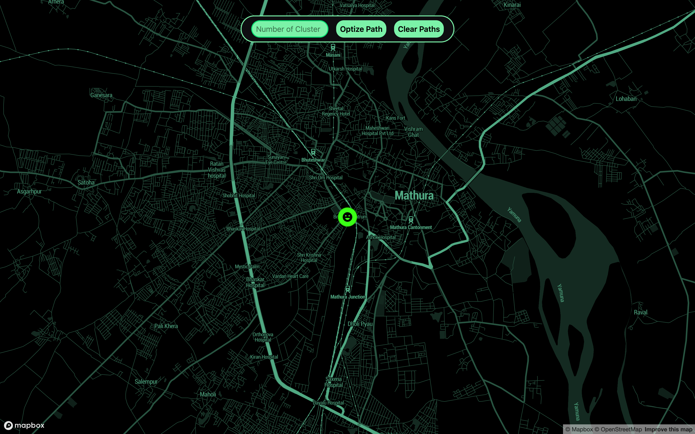

# 🚚 Delivery Route Optimization

A simple and efficient React-based frontend application that finds the optimized delivery route using **Dijkstra’s Algorithm**. Built with **Mapbox** for visualizing routes and **Tailwind CSS** for styling.

## 🌐 Live Demo

🔗 [View Live on Netlify](https://newshortcut.netlify.app/)  

---

## 📸 Screenshots

  
  

---

## ✨ Features

- 📍 Visualizes delivery points on an interactive map using Mapbox  
- 🚀 Calculates the most efficient delivery route using Dijkstra’s algorithm  
- 🎨 Clean UI styled with Tailwind CSS  
- 💡 Fully frontend — no backend required  

---

## ⚙️ Installation

```bash
# 1. Clone the repository
git clone https://github.com/your-username/your-repo-name.git
cd your-repo-name

# 2. Install dependencies
npm install
```

### 🔐 Environment Variables

Create a `.env` file in the root of your project and add your Mapbox access token:

```env
VITE_MAPBOX_ACCESS_TOKEN=your_mapbox_access_token
```

```bash
# 3. Start the development server
npm run dev
```

---

## 🧰 Tech Stack

- **React**
- **Tailwind CSS**
- **Mapbox GL JS**
- **Dijkstra’s Algorithm**

---

## 🚀 Future Improvements

- [ ] Add user-defined route input  
- [ ] Include alternative route suggestions  
- [ ] Save and export routes  

---

## 👨‍💻 Author

Made with 💻 by [Sharad Singh Chauhan](https://github.com/sharadChauhan7)

---

## 📄 License

This project is licensed under the [MIT License](LICENSE).
